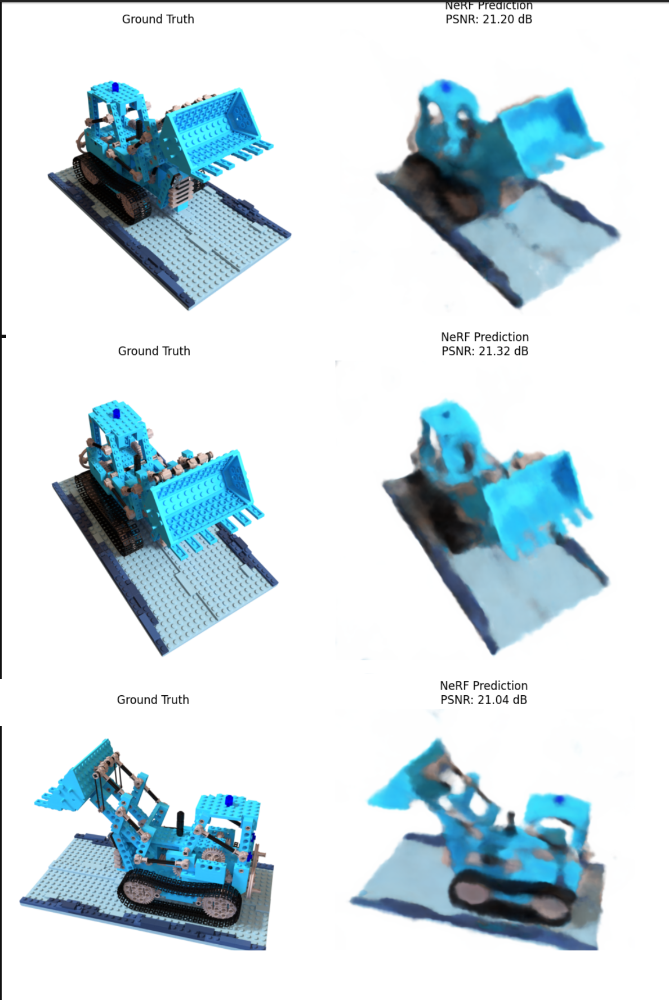

<div id="top"></div>

<br />
<div align="center">
  <h1 align="center">NeRF From Scratch</h1>

  <p align="center">
    A PyTorch implementation of a basic Neural Radiance Field (NeRF) trained on synthetic Blender scenes.
    <br />
    Built from scratch with ray sampling, positional encoding, volume rendering, PSNR evaluation, checkpointing, and full-image visualization.
  </p>
</div>

---

## About The Project

This project implements a simplified NeRF pipeline from scratch in PyTorch.

Given a set of posed images from the NeRF synthetic dataset, the model learns a continuous radiance field that maps 3D points in space to:

- **Density** (`sigma`)
- **Color** (`rgb`)

The training pipeline includes:

- camera ray generation from intrinsic and extrinsic parameters
- 3D point sampling along rays
- positional encoding
- MLP-based radiance field prediction
- opacity and transmittance computation
- differentiable volume rendering
- PSNR-based evaluation
- checkpoint saving during training

This implementation is designed as a learning-focused NeRF baseline rather than a full production NeRF.

---

## Output Preview

Replace the placeholder below with your rendered result.

<p align="center">
  
</p>

---

## Built With

- Python
- PyTorch
- NumPy
- OpenCV
- Matplotlib
- Plotly

---

## Project Structure

```bash
.
├── nerf_synthetic/
│   └── lego/
│       ├── transforms_train.json
│       └── *.png
├── images/
│   └── output.png
├── nerf_checkpoint_epoch_10.pth
├── nerf_checkpoint_epoch_20.pth
├── practice.ipynb
└── README.md
